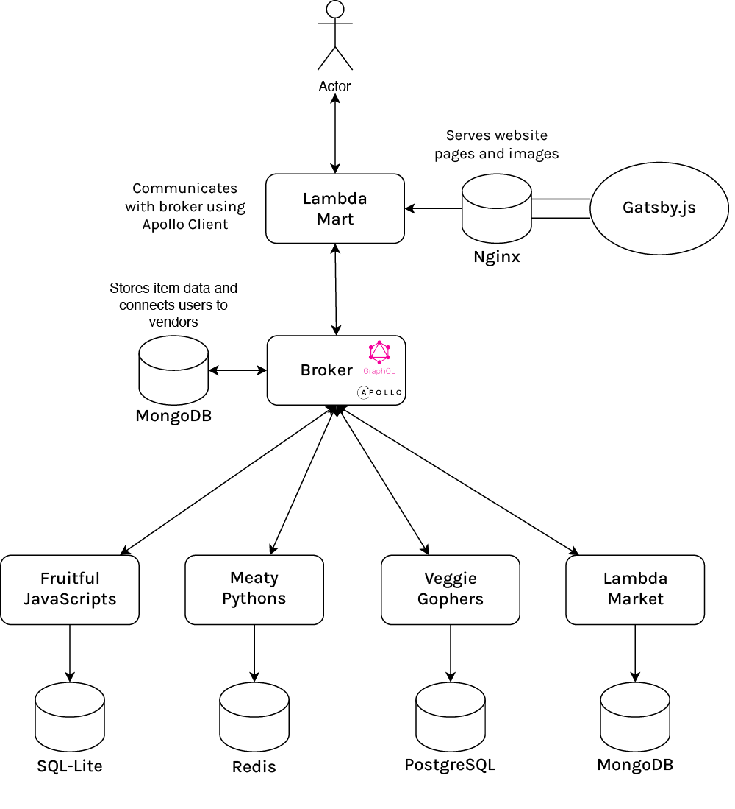

# LambdaMart – Report

## Description

LambdaMart is an online distributed marketplace for purchasing *"THINGS"*. It is a distributed system that consists of a frontend, a broker, and a backend. The frontend allows users to browse. and purchase items, and was built using React [1, 2] and Gatsby [3]. The broker is a GraphQL [4] server that acts as a middleman between the frontend and the backend. The backend is a REST API [5] using GraphQL that manages the items and vendors.

## Architecture

The goal when building this system was to create a distributed marketplace where vendors were free to create services in whatever language they wanted, backed by whatever database they wanted. We wanted to make it so that new vendors could register themselves on the fly and that the frontend would be able to query the backend for information about the vendors and their items. As a result, each vendor could be run independently.

### Broker

The broker connects the users to the vendors by acting as a middleman between the frontend and the backend. It is built using NodeJS [6] and Express (with TypeScript), and MongoDB.

### Vendors

#### Fruitful JavaScripts

Fruitful JavaScripts sells fruits and is built using NodeJS and SQL Lite.

#### Meaty Pythons

Meaty Pythons sells totally legal reptilian meats and also some vegan options, and is built using Python and Redis.

#### Veggie Gophers

Veggie Gophers sells vegetables and is built using GoLang and PostgreSQL.

#### Lambda Market

Lambda market is the vendor for our imaginary company. It sells every single item and was built using NodeJS and MongoDB.

### Frontend

The frontend was built using Gatsby and TypeScript. It is a static website that is hosted using Nginx. It uses GraphQL through Apollo Client to query the broker for information about the vendors and their items.

By using Nginx [8], we were able to achieve stability and scalability. Nginx is a very stable web server that is used by many large companies. It is also very scalable and can handle many concurrent connections.

Another benefit of using Gatsby was that by using Gatsby Image, we were able to optimize the images on the website. This was done by generating multiple versions of each image with different sizes and resolutions. This allowed us to serve the best image for each user's device, whilst also baking in fallbacks into our HTML.

---

### What would we do differently

#### Broker implementation

The broker was initially written in Java, but it was found to have a number of difficulties from not connecting to the frontend correctly, to not being able to query the vendors.

It was eventually re-written in TypeScript and the dynamic nature of TypeScript made it much easier to work with.

#### Use of GraphQL

We would have been better off designing two separate schemas from the start. One for the frontend and one for the backend. This would have allowed us to have a more flexible backend schema that could be changed without affecting the frontend.

We initially built a schema were the frontend GraphQL schema (website ↔ broker) was very similar to the backend schema (vendor ↔ broker). It also caused chicken vs. egg issues where information had to be queried twice to get information that was stored together in the backend.

## References

1. Meta. ["React - A JavaScript library for building user interfaces"](https://reactjs.org/). *reactjs.org*. Retrieved 7 April 2018.
2. Occhino, Tom; Walke, Jordan. React ["JS Apps at Facebook"](https://www.youtube.com/watch?v=GW0rj4sNH2w). *YouTube*. Retrieved 22 Oct 2018.
3. “Gatsby.” npm. Accessed May 31, 2023. https://www.npmjs.com/package/gatsby. 
4. Ooms J, Facebook, Inc (2023). *graphql: A GraphQL Query Parser*. https://docs.ropensci.org/graphql/, https://graphql.org (upstream) https://github.com/ropensci/graphql (devel).
5. Fielding, Roy Thomas (2000). ["Chapter 5: Representational State Transfer (REST)"](http://www.ics.uci.edu/~fielding/pubs/dissertation/rest_arch_style.htm). *Architectural Styles and the Design of Network-based Software Architectures* (Ph.D.). University of California, Irvine
6. Nodejs *Nodejs/node: Node.js javascript runtime*, *GitHub*. Available at: https://github.com/nodejs/node (Accessed: 31 May 2023). 
7. [TJ Holowaychuk](https://web.archive.org/web/20150706050636/https://tjholowaychuk.tumblr.com/) [Express.js 1.0 beta archive](https://web.archive.org/web/20150706050636/https://tjholowaychuk.tumblr.com/post/820103177/express-1-0beta), Express JS, a backend
8. Will Reese. 2008. Nginx: the high-performance web server and reverse proxy. Linux J. 2008, 173, Article 2 (September 2008).
